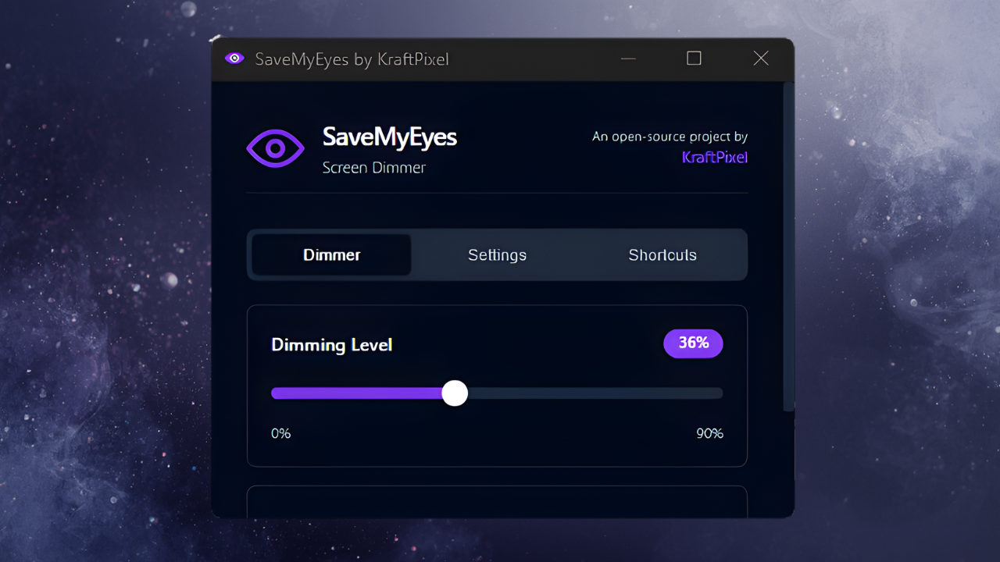

# SaveMyEyes

<p align="center">
  <strong>An open-source screen dimmer by <a href="https://kraftpixel.com">KraftPixel</a></strong>
</p>

A lightweight, cross-platform desktop utility that reduces screen luminance via a software overlay for visual comfort. The overlay is automatically hidden from screenshots and screen recordings.

<p align="center">
  <a href="https://github.com/KDSPL/SaveMyEyes/releases/latest">
    
  </a>
  &nbsp;
  <a href="https://github.com/KDSPL/SaveMyEyes/releases/latest">
    
  </a>
</p>

## Features

- 🌙 **Adjustable Dimming** — Reduce screen brightness from 0% to 90%
- 🖥️ **Multi-Monitor Support** — Independent brightness per display, remembers settings by display name
- 📸 **Capture-Safe** — Automatically hidden from screenshots and recordings
- ⌨️ **Global Hotkeys** — Control dimming from anywhere (targets the monitor under the cursor)
- 🚀 **Lightweight** — Native app on both platforms, near-zero CPU usage, minimal RAM
- 🎨 **Modern UI** — Clean, dark theme interface with card-based layout
- 🔄 **Cross-Platform** — Native Windows (Win32) and macOS (AppKit) builds

## Hotkeys

### Windows

| Action | Shortcut |
|--------|----------|
| Toggle On/Off | `Ctrl + Alt + End` |
| Increase Opacity | `Ctrl + Alt + Up` |
| Decrease Opacity | `Ctrl + Alt + Down` |

### macOS

| Action | Shortcut |
|--------|----------|
| Toggle On/Off | `⌘ ⇧ D` |
| Increase Opacity | `⌘ ⇧ >` |
| Decrease Opacity | `⌘ ⇧ <` |

## Installation

### Windows
Download the latest `.exe` from the [Releases](https://github.com/KDSPL/SaveMyEyes/releases) page. The `.exe` is portable — no installation required.

### macOS
Download the latest `.app` bundle from the [Releases](https://github.com/KDSPL/SaveMyEyes/releases) page, then drag it to your Applications folder.

### Build from Source
```bash
# Clone the repository
git clone https://github.com/KDSPL/SaveMyEyes.git
cd SaveMyEyes

# Build for Windows
cargo build --release -p savemyeyes-windows

# Build for macOS
cargo build --release -p savemyeyes-macos
cd macos && ./build-app.sh   # Creates SaveMyEyes.app bundle
```

## Screenshots

- Dimmer tab:

  

- Settings tab: 

  

- Shortcuts tab: 

  

## Tech Stack

- **Language:** Rust
- **Windows UI:** Native Win32 owner-drawn controls (GDI) via [windows-rs](https://github.com/microsoft/windows-rs)
- **macOS UI:** Native AppKit via [objc2](https://github.com/madsmtm/objc2) — NSWindow overlays, NSSlider, custom toggle controls

## Configuration

Settings are stored as JSON and shared across features:

| Platform | Path |
|----------|------|
| Windows | `%AppData%\SaveMyEyes\config.json` |
| macOS | `~/Library/Application Support/SaveMyEyes/config.json` |

Persisted settings include: opacity level, enabled state, autostart preference, multi-monitor brightness per display name, and auto-update preference.

## License

MIT License — see [LICENSE](LICENSE) for details.

## Acknowledgments

SaveMyEyes is built with these amazing open-source projects:

- [Rust](https://www.rust-lang.org) — Systems programming language
- [windows-rs](https://github.com/microsoft/windows-rs) — Rust bindings for Windows APIs
- [objc2](https://github.com/madsmtm/objc2) — Rust bindings for Apple frameworks

## Credits

Built with ❤️ by [KraftPixel](https://kraftpixel.com)
