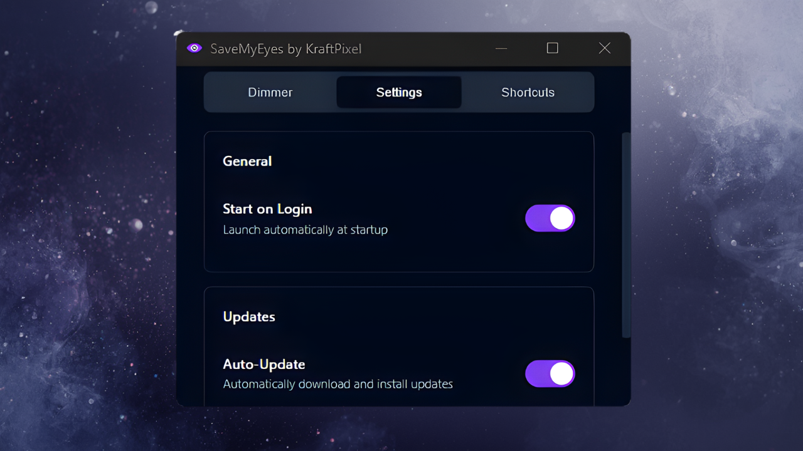
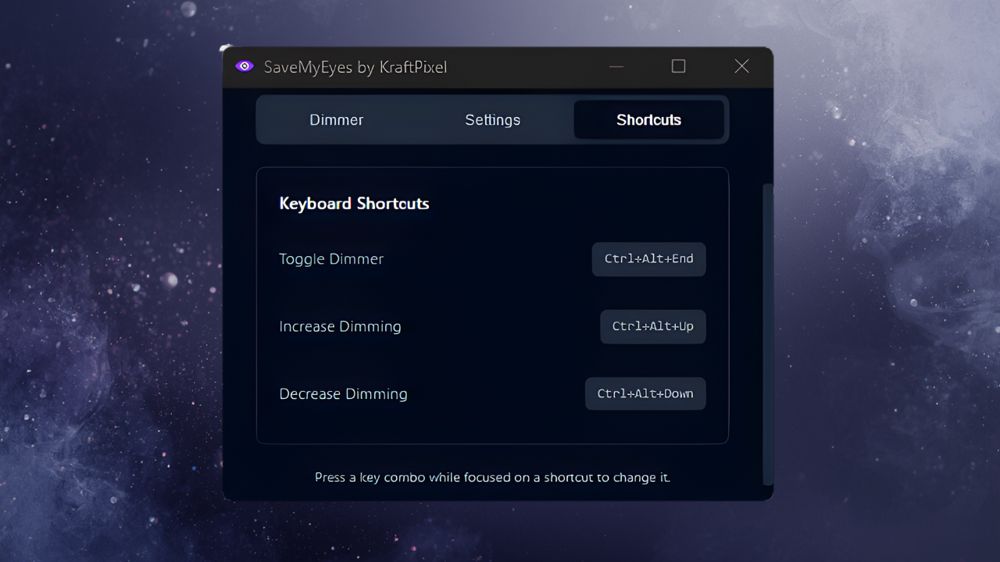

# SaveMyEyes

<p align="center">
  <strong>An open-source screen dimmer by <a href="https://kraftpixel.com">KraftPixel</a></strong>
</p>

A lightweight desktop utility that reduces screen luminance via a software overlay for visual comfort. The overlay is automatically hidden from screenshots and screen recordings.

**Quick download:** grab the latest `.exe` from the [Releases](https://github.com/KDSPL/SaveMyEyes/releases) page.

<p align="center">
  <a href="https://github.com/KDSPL/SaveMyEyes/releases/latest">
    
  </a>
</p>

## Features

- 🌙 **Adjustable Dimming** - Reduce screen brightness from 0% to 90%
- 🖥️ **Multi-Monitor Support** - Covers all connected displays
- 📸 **Capture-Safe** - Automatically hidden from screenshots and recordings
- ⌨️ **Global Hotkeys** - Control from anywhere
- 🚀 **Lightweight** - Native Win32 app, near-zero CPU usage, minimal RAM
- 🎨 **Modern UI** - Clean, dark theme interface with owner-drawn controls

## Hotkeys

| Action | Shortcut |
|--------|----------|
| Toggle On/Off | `Ctrl + Alt + End` |
| Increase Opacity | `Ctrl + Alt + Up` |
| Decrease Opacity | `Ctrl + Alt + Down` |

## Installation

### Windows
Download the latest `.exe` from the [Releases](https://github.com/KDSPL/SaveMyEyes/releases) page. The `.exe` is portable — no installation required.

### Build from Source
```bash
# Clone the repository
git clone https://github.com/KDSPL/SaveMyEyes.git
cd SaveMyEyes

# Build (requires Rust toolchain)
cargo build --release
```

The compiled binary will be at `target/release/savemyeyes.exe`.

## Screenshots

- Dimmer tab:

  

- Settings tab: 

  

- Shortcuts tab: 

  

## Tech Stack

- **Language:** Rust
- **UI:** Native Win32 owner-drawn controls (GDI)
- **Windows APIs:** [windows-rs](https://github.com/microsoft/windows-rs) for Win32 bindings

## Configuration

Settings are stored in `%AppData%\SaveMyEyes\config.json`:
- Opacity level
- Enabled state
- Autostart preference
- Hotkey bindings

## License

GNU GPL - see [LICENSE](LICENSE) for details.

## Acknowledgments

SaveMyEyes is built with these amazing open-source projects:

- [Rust](https://www.rust-lang.org) - Systems programming language
- [windows-rs](https://github.com/microsoft/windows-rs) - Rust bindings for Windows APIs

## Credits

Built with ❤️ by [KraftPixel](https://kraftpixel.com)
